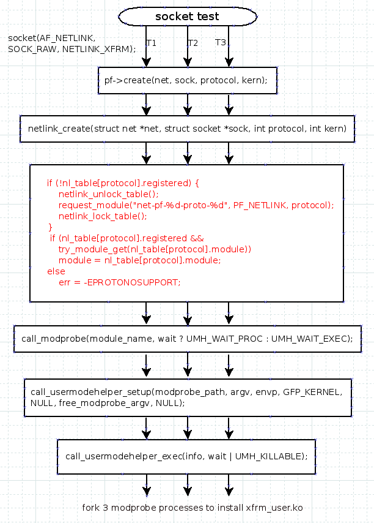
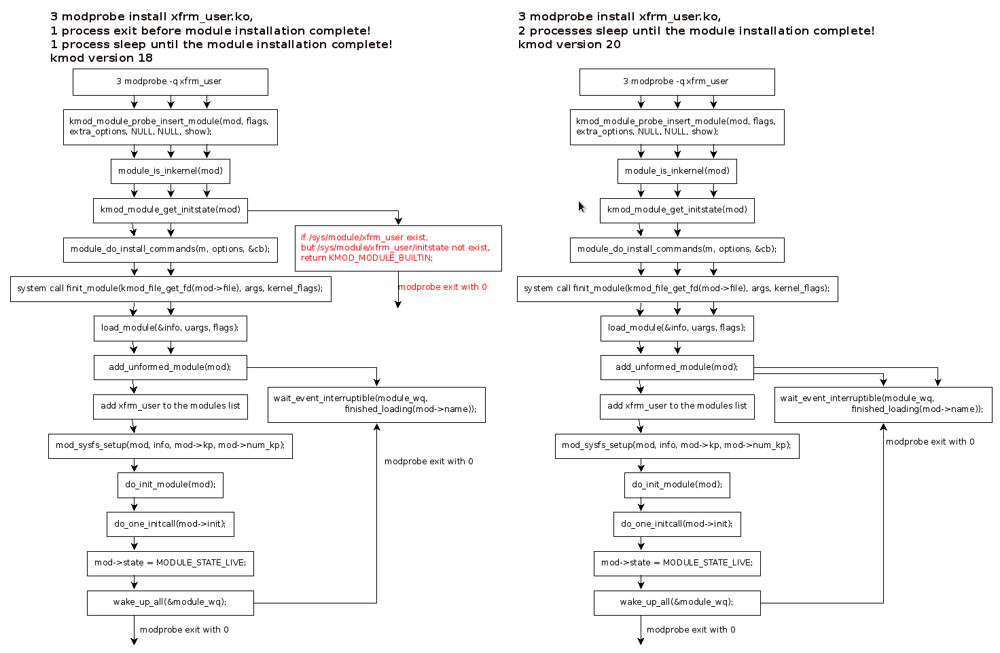

Race condition while loading modules in parallel in kmod-18
----------------------
- [Race condition while loading modules in parallel in kmod-18](#race-condition-while-loading-modules-in-parallel-in-kmod-18)
- [Triger the bug method](#triger-the-bug-method)
- [Function call procedure when calling 'modprobe'](#function-call-procedure-when-calling-modprobe)
- [kmod\_module\_get\_initstate() in kmod-18](#kmod_module_get_initstate-in-kmod-18)
- [kmod\_module\_get\_initstate() in kmod-20 - Correction](#kmod_module_get_initstate-in-kmod-20---correction)
- [Where the process blocked if module being mounted in parallel](#where-the-process-blocked-if-module-being-mounted-in-parallel)
  - [Module state definition](#module-state-definition)
  - [Function call procedure comparision](#function-call-procedure-comparision)
  - [Debug print and patch to check where the processes are blocked](#debug-print-and-patch-to-check-where-the-processes-are-blocked)
  - [finit\_module() function](#finit_module-function)


## Triger the bug method

3 processes/threads call modprobe to install same kernel module in parallel will cause the problem. 

## Function call procedure when calling 'modprobe'

Command `modprobe xfrm_user.ko` will call system call finit_module().

systemcall finit_module() in `kernel/module.c`

--> 
int load_module(struct load_info *info, const char __user *uargs, int flags)

```c 
int load_module(struct load_info *info, const char __user *uargs, int flags)

    /* Link in to syfs. */
    err = mod_sysfs_setup(mod, info, mod->kp, mod->num_kp);
    if (err < 0)
        goto bug_cleanup;

    /* Get rid of temporary copy. */
    free_copy(info);

    /* Done! */
    trace_module_load(mod);

    return do_init_module(mod);
```

--> 
err = mod_sysfs_setup(mod, info, mod->kp, mod->num_kp);


```c
static int mod_sysfs_setup(struct module *mod,
               const struct load_info *info,
               struct kernel_param *kparam,
               unsigned int num_params)
    ...
   err = mod_sysfs_init(mod);
    if (err)
        goto out;

    mod->holders_dir = kobject_create_and_add("holders", &mod->mkobj.kobj);
    if (!mod->holders_dir) {
        err = -ENOMEM;
        goto out_unreg;
    }

    err = module_param_sysfs_setup(mod, kparam, num_params);
    if (err)
        goto out_unreg_holders;

    err = module_add_modinfo_attrs(mod);
    if (err)
        goto out_unreg_param;

    add_usage_links(mod);
    add_sect_attrs(mod, info);
    add_notes_attrs(mod, info);

    kobject_uevent(&mod->mkobj.kobj, KOBJ_ADD);
    return 0;
```
**mod_sysfs_init(mod)** will add the xfrm_user to the kobject link table, 
means create the directory **/sys/modules/xfrm_user**.

**module_param_sysfs_setup(mod, kparam, num_params);** will create module's specific parameters 
in **/sys/modules/xfrm_user/parameters/** directory.

**module_add_modinfo_attrs(mod);** will create uniform attributes for every kernel module. 

```c
static struct module_attribute *modinfo_attrs[] = {                                   
    &module_uevent,                                                                   
    &modinfo_version,                                                                 
    &modinfo_srcversion,                                                              
    &modinfo_initstate,                                                               
    &modinfo_coresize,                                                                
    &modinfo_initsize,                                                                
    &modinfo_taint,                                                                   
#ifdef CONFIG_MODULE_UNLOAD                                                           
    &modinfo_refcnt,                                                                  
#endif                                                                                
    NULL,                                                                             
}; 
static struct module_attribute modinfo_initstate =
    __ATTR(initstate, 0444, show_initstate, NULL);
```

From above analysis, **/sys/module/\<module name\>** and
  **/sys/module/\<module name\>/initstate** creations are not atomic. There's a small window in
  which the directory exists but the initstate file was still not created.

**This window cause the kmod modprobe logic error when check the module init state.**

modprobe will check the kernel module initstate before call finit_module(), 
check initstate is done by function:**kmod_module_get_initstate().**

## kmod_module_get_initstate() in kmod-18

```c
KMOD_EXPORT int kmod_module_get_initstate(const struct kmod_module *mod)

    pathlen = snprintf(path, sizeof(path),
                "/sys/module/%s/initstate", mod->name);
    fd = open(path, O_RDONLY|O_CLOEXEC);
    if (fd < 0) {
        err = -errno;

        DBG(mod->ctx, "could not open '%s': %s\n",
            path, strerror(-err));

        if (pathlen > (int)sizeof("/initstate") - 1) {
            struct stat st;
            path[pathlen - (sizeof("/initstate") - 1)] = '\0';
            if (stat(path, &st) == 0 && S_ISDIR(st.st_mode))
                return KMOD_MODULE_BUILTIN;
        }

        DBG(mod->ctx, "could not open '%s': %s\n",
            path, strerror(-err));
        return err;
    }
```
**If the `/sys/module/xfrm_user/initstate` haven't created, but `/sys/module/xfrm_user/` already there,
It will return KMOD_MODULE_BUILTIN; which means the kernel module are built in the kernel, 
which actually is not ready.**


## kmod_module_get_initstate() in kmod-20 - Correction

To check if the modules are builtin, to check the /lib/modules/`uname -r`/modules.builtin
file instead of `/sys/module/\<module name\>`, 
The modules.builtin file are created when kernel compilation in SCM phase.

```c
static char *lookup_builtin_file(struct kmod_ctx *ctx, const char *name)
{
    char *line;

    if (ctx->indexes[KMOD_INDEX_MODULES_BUILTIN]) {
        DBG(ctx, "use mmaped index '%s' modname=%s\n",
                index_files[KMOD_INDEX_MODULES_BUILTIN].fn,
                name);
        line = index_mm_search(ctx->indexes[KMOD_INDEX_MODULES_BUILTIN],
                                    name);
    } else {
        struct index_file *idx;
        char fn[PATH_MAX];

        snprintf(fn, sizeof(fn), "%s/%s.bin", ctx->dirname,
                index_files[KMOD_INDEX_MODULES_BUILTIN].fn);
        DBG(ctx, "file=%s modname=%s\n", fn, name);

        idx = index_file_open(fn);
        if (idx == NULL) {
            DBG(ctx, "could not open builtin file '%s'\n", fn);
            return NULL;
        }

        line = index_search(idx, name);
        index_file_close(idx);
    }

    return line;
}


bool kmod_lookup_alias_is_builtin(struct kmod_ctx *ctx, const char *name)
{
    _cleanup_free_ char *line;

    line = lookup_builtin_file(ctx, name);

    return line != NULL;
}


bool kmod_module_is_builtin(struct kmod_module *mod)
{
	if (mod->builtin == KMOD_MODULE_BUILTIN_UNKNOWN) {
		kmod_module_set_builtin(mod,
					kmod_lookup_alias_is_builtin(mod->ctx, mod->name));
	}

	return mod->builtin == KMOD_MODULE_BUILTIN_YES;
}

/**
 * kmod_module_get_initstate:
 * @mod: kmod module
 *
 * Get the initstate of this @mod, as returned by Linux Kernel, by reading
 * /sys filesystem.
 *
 * Returns: < 0 on error or module state if module is found in kernel, valid states are
 * KMOD_MODULE_BUILTIN: module is builtin;
 * KMOD_MODULE_LIVE: module is live in kernel;
 * KMOD_MODULE_COMING: module is being loaded;
 * KMOD_MODULE_GOING: module is being unloaded.
 */
KMOD_EXPORT int kmod_module_get_initstate(const struct kmod_module *mod)
{
	char path[PATH_MAX], buf[32];
	int fd, err, pathlen;

	if (mod == NULL)
		return -ENOENT;

	/* remove const: this can only change internal state */
	if (kmod_module_is_builtin((struct kmod_module *)mod))
		return KMOD_MODULE_BUILTIN;

	pathlen = snprintf(path, sizeof(path),
				"/sys/module/%s/initstate", mod->name);
	fd = open(path, O_RDONLY|O_CLOEXEC);
	if (fd < 0) {
		err = -errno;

		DBG(mod->ctx, "could not open '%s': %s\n",
			path, strerror(-err));

		if (pathlen > (int)sizeof("/initstate") - 1) {
			struct stat st;
			path[pathlen - (sizeof("/initstate") - 1)] = '\0';
			if (stat(path, &st) == 0 && S_ISDIR(st.st_mode))
				return KMOD_MODULE_COMING;
		}

		DBG(mod->ctx, "could not open '%s': %s\n",
			path, strerror(-err));
		return err;
	}

	err = read_str_safe(fd, buf, sizeof(buf));
	close(fd);
	if (err < 0) {
		ERR(mod->ctx, "could not read from '%s': %s\n",
			path, strerror(-err));
		return err;
	}

	if (streq(buf, "live\n"))
		return KMOD_MODULE_LIVE;
	else if (streq(buf, "coming\n"))
		return KMOD_MODULE_COMING;
	else if (streq(buf, "going\n"))
		return KMOD_MODULE_GOING;

	ERR(mod->ctx, "unknown %s: '%s'\n", path, buf);
	return -EINVAL;
}
```

[Race condition while loading modules in parallel in kmod-18 patch](m314/linux/0001-Fix-race-while-loading-modules.patch)

[kmod source code commit of the patch](https://github.com/lucasdemarchi/kmod/commit/fd44a98ae2eb5eb32161088954ab21e58e19dfc4)

## Where the process blocked if module being mounted in parallel

If 3 threads call **socket(AF_NETLINK, SOCK_RAW, NETLINK_XFRM)**; in parallel,
which will trigger 3 modprobe processes start to load kernel module xfrm_user.ko.
Only 1 unique process will load the module, other 2 processes should be blocked.
**Where the other 2 processes blocked?**

From the kmod-20 code, we can get it get the dependency analysis in the kmod before loading modules, 
then load modules one by one according the dependency list by finit_module() system call. 

It call finit_module() systemcall to load kernel modules.
--> 
int load_module(struct load_info *info, const char __user *uargs, int flags)
```c
static int load_module(struct load_info *info, const char __user *uargs, int flags)
{
    struct module *mod;
    long err;

    err = module_sig_check(info);
    if (err)
        goto free_copy;

    err = elf_header_check(info);
    if (err)
        goto free_copy;

    /* Figure out module layout, and allocate all the memory. */
    mod = layout_and_allocate(info, flags);
    if (IS_ERR(mod)) {
        err = PTR_ERR(mod);
        goto free_copy;
    }

    /* Reserve our place in the list. */
    err = add_unformed_module(mod);
    if (err)
        goto free_module;
...

    /* Link in to syfs. */
    err = mod_sysfs_setup(mod, info, mod->kp, mod->num_kp);
    if (err < 0)
        goto bug_cleanup;

    /* Get rid of temporary copy. */
    free_copy(info);

    /* Done! */
    trace_module_load(mod);

    return do_init_module(mod);
...
}
```

In the `add_unformed_module(mod)`, it will check if the module already installed. 

```c
/*
 * We try to place it in the list now to make sure it's unique before
 * we dedicate too many resources.  In particular, temporary percpu
 * memory exhaustion.
 */
static int add_unformed_module(struct module *mod)
{
    int err;
    struct module *old;

    mod->state = MODULE_STATE_UNFORMED;

again:
    mutex_lock(&module_mutex);
    if ((old = find_module_all(mod->name, true)) != NULL) {
        if (old->state == MODULE_STATE_COMING
            || old->state == MODULE_STATE_UNFORMED) {
            /* Wait in case it fails to load. */
            mutex_unlock(&module_mutex);
            err = wait_event_interruptible(module_wq,
                           finished_loading(mod->name));
            if (err)
                goto out_unlocked;
            goto again;
        }
        err = -EEXIST;
        goto out;
    }
    list_add_rcu(&mod->list, &modules);
    err = 0;

out:
    mutex_unlock(&module_mutex);
out_unlocked:
    return err;
}
```
There is a mutex **module_mutex** for this purpose, if the module already installed and state is LIVE, 
the finit_module() will return -EEXIST immediately. 
If the module is installing, state is not LIVE or GOING, the modprobe process will be blocked and put to wait queue(**module_wq**).
It will be waked up if the module installation finish, or failed.
If there is no same module name found from the **modules** list, 
the new module name will be added to the **modules** list, and go on to install the module.

### Module state definition
During module installation, module's state was changed according to different phase.

```c
include/linux/module.h 
enum module_state {
    MODULE_STATE_LIVE,  /* Normal state. module initialize complete!*/
    MODULE_STATE_COMING,    /* Full formed, running module_init. */
    MODULE_STATE_GOING, /* Going away. failed to initialize the module*/
    MODULE_STATE_UNFORMED,  /* Still setting it up. in the early phase*/
};
```

### Function call procedure comparision

When the problem happens in kmod-18, the function call procedure is different to the procedure in kmod-20.
Take `sockettest` as an example, 3 threads will be created to call socket(),
which triggers 3 processes to install xfrm_user.ko module in parallel!




### Debug print and patch to check where the processes are blocked

[Debug print patch](m314/linux/0001-debug-where-the-modprobe-block-if-multiple-processes-modprobe-same-module.patch)

Because of the dependencies, install xfrm_usr.ko will install xfrm_algo.ko first, then xfrm_usr.ko.
Debug logs:
```c
    [   53.806738] IPv6: ADDRCONF(NETDEV_CHANGE): xaui2: link becomes ready
    [   69.516325] vrha: vrha_set_polling_mode : (ACTIVE)
    [   84.373189] finit_module: 2840, modprobe
    [   84.373344] unformed module: 2840, modprobe, mod name: xfrm_algo
    [   84.373366] finit_module: 2846, modprobe
    [   84.373476] unformed module: 2846, modprobe, mod name: xfrm_algo
    [   84.373480] finit_module: 2843, modprobe
    [   84.373768] wait in the module_wq: 2846, modprobe
    [   84.373790] unformed module: 2843, modprobe, mod name: xfrm_algo
    [   84.373798] wait in the module_wq: 2843, modprobe
    [   84.373888] call module init 2840, modprobe, xfrm_algo!
    [   84.373912] mod xfrm_algo already exist! 2846, modprobe
    [   84.373924] mod xfrm_algo already exist! 2843, modprobe
    [   84.373970] finit_module: 2840, modprobe
    [   84.373992] finit_module: 2846, modprobe
    [   84.374003] finit_module: 2843, modprobe
    [   84.374129] unformed module: 2843, modprobe, mod name: xfrm_user
    [   84.374137] unformed module: 2846, modprobe, mod name: xfrm_user
    [   84.374143] unformed module: 2840, modprobe, mod name: xfrm_user
    [   84.374149] wait in the module_wq: 2843, modprobe
    [   84.374178] wait in the module_wq: 2840, modprobe
    [   84.374641] call module init 2846, modprobe, xfrm_user!
    [   84.374659] Initializing XFRM netlink socket
    [   84.374704] mod xfrm_user already exist! 2843, modprobe
    [   84.374791] mod xfrm_user already exist! 2840, modprobe
```
### finit_module() function 
```c
    int finit_module(int fd, const char *param_values,
                            int flags);
```

Reads the module to be loaded from the file descriptor fd into kernel space, performs any necessary symbol relocations, 
then, check if the module already installed, setup sysfs directory for the module, initializes module parameters to values provided by the caller,
and then runs the module's init function.  

