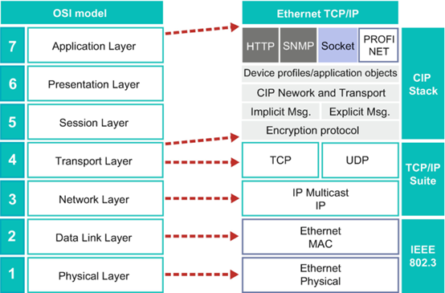
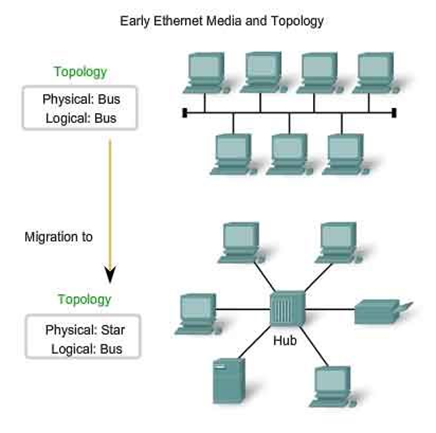
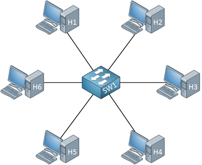
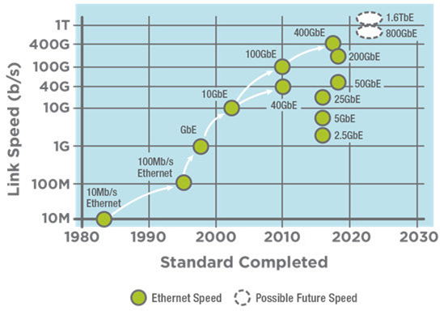
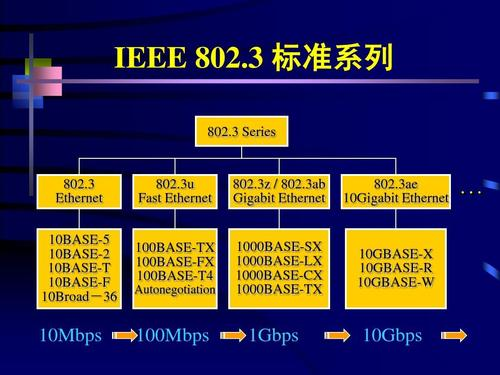
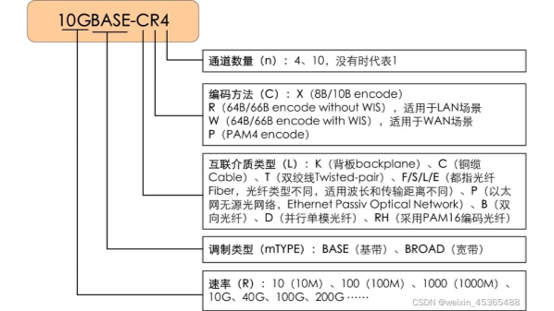
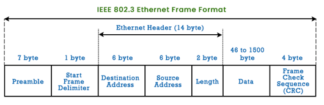
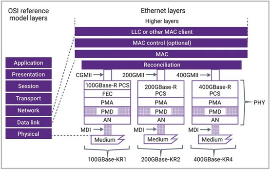
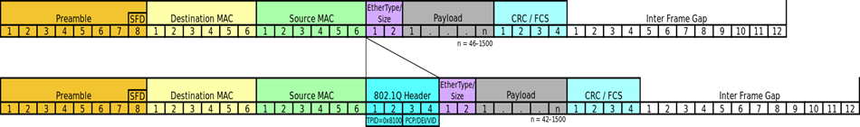

# Ethernet Introduction

OSI定义了7层网络模型，在网络实现中，我们听到最多的是TCP/IP协议和Ethernet。Ethernet处在那一层呢？ 
Ethernet是一个工作在数据链路层和物理层的协议。Ethernet又分成了哪几个子层?
 - Link layer control/Media access control
 - Phy: 
    - Physical coding layer (编码)
    - Physical medium dependent(媒介)

  

 
## 以太网简介
以太网是一种局域网联网技术，工作在数据链路层和物理层，由哈佛大学一名博士生(Bob Metcalfe, 后来创立了3Com)于20世纪70年代发明。 发明早期，以太网面临来自其他局域网技术（比如令牌环，FDDI， ATM）的竞争。但是，以太网技术也在不断更新迭代，演化发展，到现在已经成为最流行的有线局域网技术。可以说，**以太网对本地区域联网的重要性就像因特网对全球联网所具有的地位那样。** 

 
## 以太网发展主要经历3个阶段
 - 以太网早期(70年代)， 使用同轴电缆总线来互联节点，是一种广播局域网，采用二进制指数回退(Binary exponential backoff)的CSMA/CD多路访问协议。 
 - 到20世纪90年代后期，开始流行使用基于集线器的星形拓扑以太网，集线器(Hub)是一种物理层设备，它作用于各个比特而不是作用于帧。因此，它依旧是一个广播局域网，无论何时从一个接口收到一个比特，它向其他所有接口发送该比特的副本。会发生碰撞，必须重新传输。

 - 到21世纪初，出现一次重要的革命性变化，集线器换成了交换机(switch), 避免了碰撞，实现了存储转发分组。 

 
IEEE802 定义了局域网&城域网标准，而802.3定义了以太网标准，802.3实际上是一个以太网标准集，定义了很多和以太网相关的标准(不同的speed有对应的不同的标准，PoE(Power over Ethernet), 链路聚合, etc)。
这些标准有什么不同呢？ 后缀代表什么意思?

 
## 以太网帧结构
前同步码(8字节 Preamble): 以太网帧以一个8byte的前同步码(Preamble)字段开始， 前7bytes都是10101010，用于”唤醒”适配器，并且将它们的时钟和发送方的时钟同步，最后一个字节是10101011，最后2bit警告适配器，重要的内容要来了。 
 
FCS(Frame Check Sequence): 通过CRC检测差错

以太网的物理层：
因为交换机是即插即用的，链路层彼此隔离，所以主机和交换机可以用不同的链路连接，每个链路支持的物理介质（光纤, 同轴电缆, 双绞线, 电气背板）也可以不同，速率(1G, 10G, 100G)也可以不同。以太网定义了一些物理层标准：

## VLAN(Virtual Local Area Network)
在一个局域网里可以有很多个计算机，他们用于处理不同的业务，比如HR部门正在讨论裁员，开发部门正在讨论代码， 财务部门正在讨论加薪。有些敏感的数据肯定不希望在整个局域网里传播，也不希望和不相关的部门在同一个局域网，这里有安全上的考虑。所以引入了虚拟局域网的概念。 
VLAN由IEEE 802.1Q标准定义，在这个标准里定义了带vlan tagging的Ethernet frame。 

  
