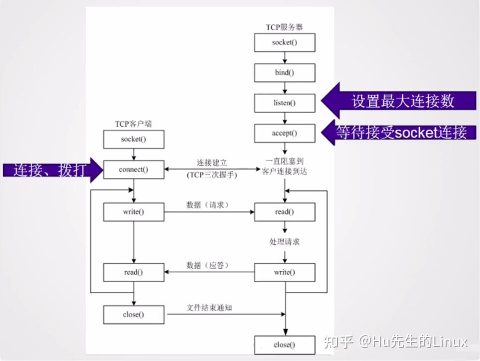

网络编程有多种模型:
基于IO模型的网络编程
因为server端需要阻塞去等待网络IO事件, 每一个IO事件需要一个线程来执行.但是server的资源是有限的, 线程资源也有限,所以这个方案不是很可取. 

server端也可以不阻塞来处理IO事件，但是需要在user space对所有的socket做循环检测。 

基于事件的网络编程模型, 即将IO事件的检测和IO事件的处理分开处理， IO事件的检测通过select/poll/epoll等来检测事件是否就绪， 这些函数可以实现IO多路复用，在内核里检测多条连接是否就绪。IO事件有多种类型，比如
read读事件
write写事件
connect事件
accept事件

当检测到事件之后，在将事件分发给不同的线程去处理。 

